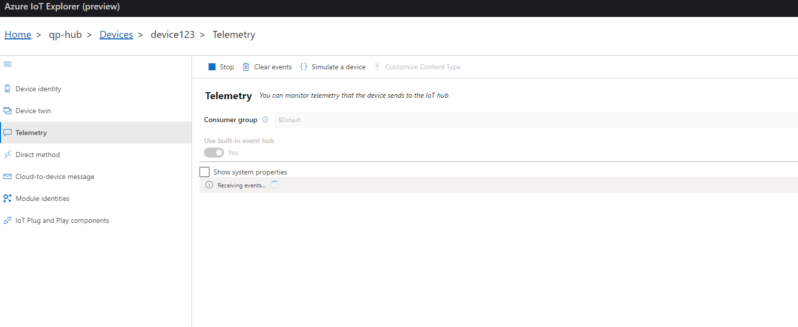
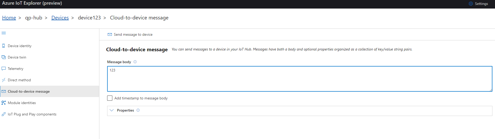
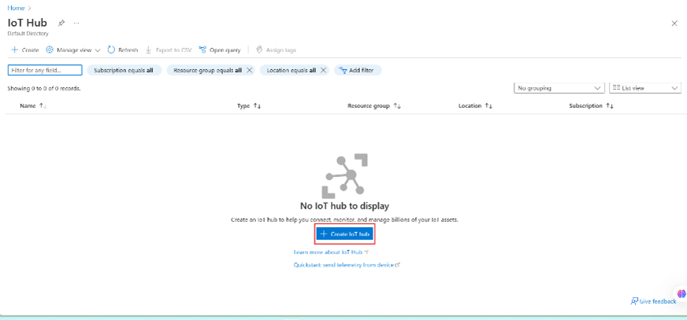
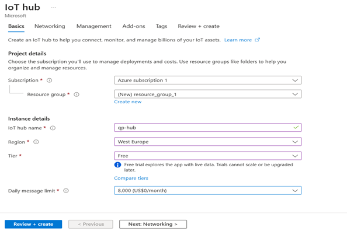
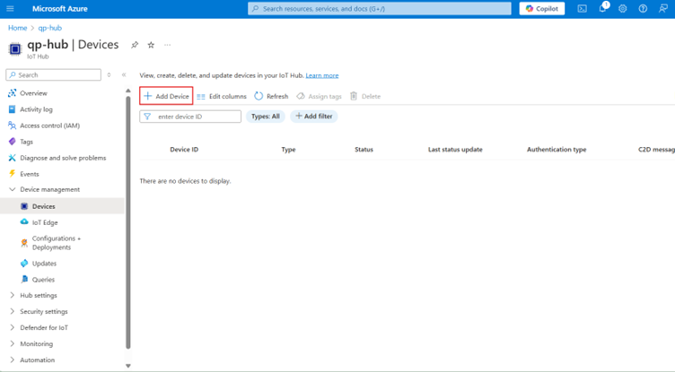
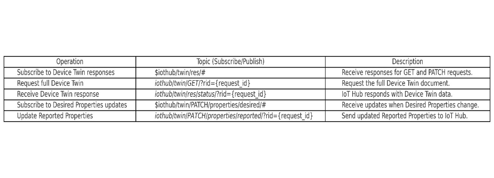
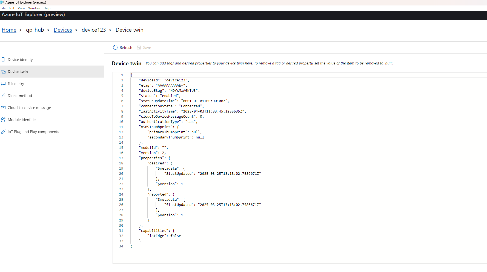
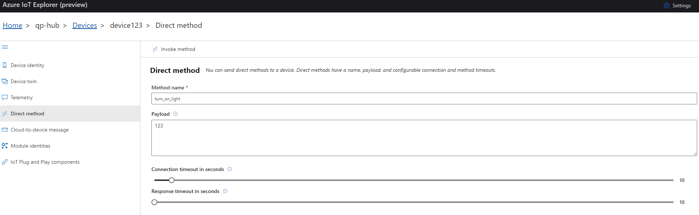
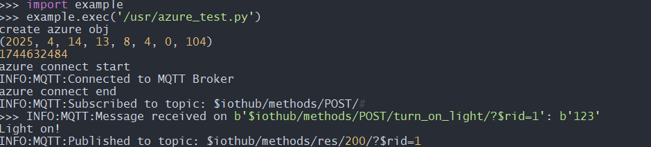

# Azure IoT Hub User Guide

## Azure IoT Hub – Core Concepts and Overview

Azure IoT Hub is a cloud-based service that serves as a central communication hub for IoT solutions. It enables secure and scalable connectivity between IoT devices and the cloud, allowing devices to send telemetry data, receive commands, and manage configurations remotely.

Key features of Azure IoT Hub include:

- **Bidirectional Communication**: 
    - **Device-to-Cloud (Telemetry Data)**: Devices send sensor readings, logs, and events to the cloud.
    - **Cloud-to-Device (Commands & Notifications)**: The cloud sends updates, configuration changes, or direct commands to devices.
- **Protocol Support**: Primarily uses MQTT for communication, with options for AMQP and HTTPS.
- **Authentication**: Supports SAS Tokens and CA-signed X.509 certificates for secure device authentication.

Azure IoT Hub is essential for managing large-scale IoT deployments, ensuring secure and reliable communication between millions of connected devices and cloud applications.

---

## Understanding MQTT Communication in Azure IoT Hub

Azure IoT Hub supports the MQTT protocol, but it is not a full-fledged MQTT broker like Mosquitto or HiveMQ. Instead, it enforces strict topic structures and authentication mechanisms to ensure secure communication.

### MQTT Topics in Azure IoT Hub

IoT Hub allows devices to:

1. **Send Messages to the Cloud (Device-to-Cloud - D2C)**:
     Devices send telemetry data to IoT Hub using the topic:
     ```
     devices/{device_id}/messages/events/
     ```
     - `{device_id}`: The unique identifier of the device.
     - **Example**: 
         ```python
         client.publish("devices/myDevice/messages/events/", "temperature=25.5")
         ```

2. **Receive Messages from the Cloud (Cloud-to-Device - C2D)**:
     Devices subscribe to receive messages from the cloud using the topic:
     ```
     devices/{device_id}/messages/devicebound/#
     ```
     - **Example**:
         ```python
         client.subscribe("devices/myDevice/messages/devicebound/#")
         ```

### Why Azure IoT Hub is Not a Full MQTT Broker

- **Restricted Topics**: Devices can only communicate with IoT Hub, not directly with each other.
- **No Message Forwarding**: IoT Hub does not forward MQTT messages between devices.
- **Strict Authentication**: Devices must authenticate using SAS tokens or X.509 certificates.
- **QoS Limitations**: 
    - IoT Hub does not support QoS 2 messages.
    - If a device publishes with QoS 2, IoT Hub closes the connection.
    - Subscriptions with QoS 2 are downgraded to QoS 1.

Azure IoT Hub's MQTT implementation ensures secure, controlled communication, making it ideal for enterprise-grade IoT solutions.


In IoT Explorer tool you can see device to cloud messages in Telemetry window. When you click start, all D2C messages published on previously mentioned reserved topic will be displayed here:


Also if you want to send message from cloud to device, you can do it in Cloud-to-device message window:



# Solution

## Setup before running the code

### Create an IoT Hub

1. Navigate to the **IoT Hub** service in the Azure portal and select **Create**.



2. Fill in the required fields:



    - **Resource Group**: Select an existing resource group or create a new one. A resource group is a container that holds related resources for an Azure solution.
    - **Region**: Choose the region closest to your devices for optimal performance.
    - **Pricing and Scale Tier**: Select the appropriate tier based on your expected usage.
3. Review your configuration and click **Create** to deploy the IoT Hub.

### Create a Device

1. After the IoT Hub is created, go to the **IoT devices** section under your IoT Hub.
2. Select **+ Add Device** to create a new device.



3. Fill in the following details:


    - **Device ID**: Enter a unique name for your device.
    - **Authentication Type**: Choose between:
      - **Symmetric Key**: Default option for SAS token-based authentication.
      - **X.509 CA Signed**: For certificate-based authentication.
4. Click **Save** to register the device.

> **Note**: 
> - For SAS token authentication, refer to the [official Azure IoT Hub documentation](https://learn.microsoft.com/en-us/azure/iot-hub/iot-hub-devguide-security).
> - For X.509 certificate authentication, ensure you have a valid certificate issued by a trusted CA.

---

## Connect to IoT Hub

### Example: Connecting to Azure IoT Hub using SAS Token

The following example demonstrates how to connect a device to Azure IoT Hub using a Shared Access Signature (SAS) token for authentication:

```python
import usr.azure as azure
import modem
from usr.config import CERT, PRIVATE_KEY, SHARED_ACCESS_KEY, PASSWORD

# Device and Hub details
client_id = 'device_qp'
server = 'qp-hub.azure-devices.net'
port = 8883

# Generate MQTT username and URI
username = '{}/{}/?api-version=2021-04-12'.format(server, client_id)
uri = '{}/devices/{}'.format(server, client_id)

def event_callback(data):
    # Custom logic to handle incoming MQTT messages
    print(f"Received data: {data}")

# Create Azure object
azure_obj = azure.Azure(
     client_id, server, port, keep_alive=60,
     user=username, password=PASSWORD,
     ssl=True, ssl_params={"cert": CERT, "key": PRIVATE_KEY}
)

# Generate SAS token
token = azure_obj.generate_sas_token(uri, SHARED_ACCESS_KEY, None)
azure_obj.mqtt_client.password = token

# Connect to IoT Hub
azure_obj.connect()
azure_obj.start()
```

This example uses the `azure` module to handle MQTT communication with Azure IoT Hub. Replace placeholders like `CERT`, `PRIVATE_KEY`, and `SHARED_ACCESS_KEY` with your actual credentials.


### Azure 

- **`modem`, `ujson`, `uiosn`** – Modules used in MicroPython for modem communication and JSON processing.
- **`config`** – Configuration file containing certificate paths, keys, and credentials.
- **`client_id`** – Name of the IoT device (Device ID in Azure).
- **`server`** – Fully Qualified Domain Name (FQDN) of your Azure IoT Hub.
- **`port`** – MQTT over TLS port (default is `8883`).
- **`uri`** – URI used to generate the SAS token.
- **`SharedAccessKey`** – The key used to sign the SAS token.

#### Callback (Optional)

A callback function can be implemented to handle incoming MQTT messages or events. For example:

```python
def event_callback(data):
    # Custom logic to handle incoming MQTT messages
    print(f"Received data: {data}")
```

This function serves as a placeholder for processing incoming MQTT messages. You can customize it based on your application's requirements.

#### Generating a SAS Token

A new SAS token can be generated using the following method:

```python
def generate_sas_token(self, uri, key, policy_name=None, expiry=3600):
    # Logic to generate a SAS token
    pass
```

The generated token is then assigned as the MQTT password for secure communication.

#### Starting the MQTT Client

The `start()` method begins the client loop, enabling tasks such as publishing, subscribing, and listening for incoming messages. Once the loop is active, you can perform operations like sending messages, subscribing to topics, or disconnecting from the IoT Hub.

## Device Twins

### What Are Device Twins?

Device Twins are structured JSON documents used by Azure IoT Hub to store metadata, configurations, and the state of IoT devices. They enable synchronization between cloud applications and IoT devices, even when devices are offline. Device Twins are essential for managing and monitoring IoT devices, supporting tasks like configuration updates, status tracking, and cloud-to-device communication.

### How Device Twins Work

Every device connected to Azure IoT Hub automatically has a Device Twin. Cloud applications can read, update, and synchronize the twin to ensure the device state is accurately reflected in the cloud.

A Device Twin consists of three main sections:

1. **Tags**  
    - User-defined key-value pairs.  
    - Used for grouping, searching, and filtering devices.  
    - **Example**:  
      ```json
      "tags": {
         "location": "Warehouse A",
         "deviceType": "TemperatureSensor"
      }
      ```

2. **Desired Properties**  
    - Set by cloud applications to configure the device.  
    - The device reads these properties and applies the settings.  
    - **Example**:  
      ```json
      "properties": {
         "desired": {
            "temperatureThreshold": 25
         }
      }
      ```
      A temperature sensor receiving this property would update its threshold to 25°C.

3. **Reported Properties**  
    - Sent from the device to inform the cloud about its actual state.  
    - Used to confirm that desired properties have been applied or to report device status.  
    - **Example**:  
      ```json
      "properties": {
         "reported": {
            "temperatureThreshold": 25,
            "batteryLevel": 80
         }
      }
      ```
      This allows the cloud to verify that the device applied the configuration and provides additional details like battery level.

## MQTT Communication with Device Twins

Device Twins in Azure IoT Hub provide a structured mechanism for synchronizing state between the cloud and IoT devices. Using MQTT, devices can:

- **Retrieve** their Device Twin (full twin document).
- **Monitor changes** to Desired Properties.
- **Update** Reported Properties.

### MQTT Topics for Device Twin Communication



#### Retrieving the Device Twin

To fetch the full Device Twin, the device follows these steps:

1. **Subscribe** to receive responses:
    ```
    $iothub/twin/res/#
    ```

2. **Publish** an empty message to request the twin:
    ```
    $iothub/twin/GET/?$rid={request_id}
    ```
    - `{request_id}`: A unique identifier for tracking the request.

3. **Receive a response** on the topic:
    ```
    $iothub/twin/res/{status}/?$rid={request_id}
    ```
    - `{status}`: Typically `200` if the request is successful.
    - The message payload contains the full Device Twin JSON.

#### Method for Retrieving the Twin

Use the following method to retrieve the Device Twin:
```python
def retrieve_twin(request_id, qos=0)
```

### Updating Reported Properties

To inform the cloud about the device's current state, the device publishes an update to the Reported Properties topic:

```
$iothub/twin/PATCH/properties/reported/?$rid={request_id}
```

- **Payload**: Must be JSON-formatted.
- **Example**:
    ```json
    {
        "temperature": 22.5,
        "status": "active"
    }
    ```

#### Method for Updating Reported Properties

The following function can be used to update the Device Twin's reported properties:

```python
def update_twin(self, payload, request_id=None, qos=0)  
```

This method ensures the device's state is synchronized with the cloud, enabling effective monitoring and management.

If you want to check device twin content, you can do it in Explorer:



## Direct Methods

Direct methods allow cloud applications to invoke specific actions on a device. To handle direct methods, you need to implement a callback function that processes the method request and sends a response back to Azure IoT Hub.

### Example: Handling Direct Methods

The following function demonstrates how to handle direct method calls:

```python
def handle_method(self, method_name, msg):
    if method_name == "turn_on_light":
        self.send_method_response(200, "Light turned on")
    else:
        self.send_method_response(404, "Method not found")
```

### Initializing the Direct Method Handler

After defining the callback function, initialize the direct method handler using:

```python
def init_direct_method_handler(method_handler)
```

### Sending a Response

To send a response back to the IoT Hub, use the following method:

```python
def send_method_response(status, message, request_id)
```

This ensures the IoT Hub receives the appropriate status and message for the invoked method.

```python
import usr.azure as azure
import modem
import ujson
from usr.config import CERT,PRIVATE_KEY,SHARED_ACCESS_KEY, PASSWORD


# device name
client_id = 'device123'
# server address
server = 'qp-hub.azure-devices.net'
# port MQTT
port = 8883

username = '{}/{}/?api-version=2021-04-12'.format(server, client_id)

uri = "{}/devices/{}".format(server, client_id)
SharedAccessKey = SHARED_ACCESS_KEY

def event_callback(data):
    pass

def handle_method(method_name, msg, request_id):
    if method_name == "turn_on_light":
        # Uključi svetlo
        print("Light on!")
        azure_obj.send_method_response(200, "Light on", request_id)
    else:
        azure_obj.send_method_response(404, "Method not found", request_id)

# create azure obj
azure_obj = azure.Azure(client_id, server, port, keep_alive=60, user=username, password=PASSWORD, ssl=True, ssl_params={"cert": 
CERT, "key": PRIVATE_KEY})
print("create azure obj")

#generate token 
token = azure_obj.generate_sas_token(uri, SharedAccessKey, None)
azure_obj.mqtt_client.password = token

# connect mqtt server
print("azure connect start")
azure_obj.connect()
print("azure connect end")

azure_obj.init_direct_method_handler(handle_method)

azure_obj.start()
```

In Azure IoT Explorer you can send a direct method message:



Response from device:

